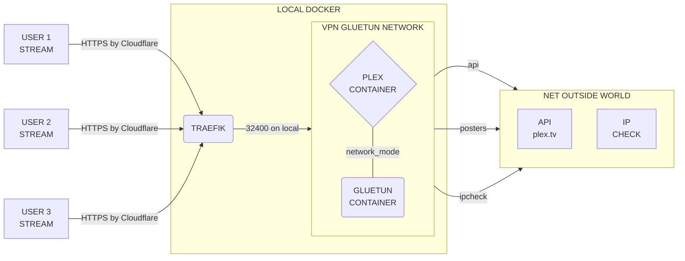

# Installations de Plex sous VPN avec Gluetun

Ce guide explique comment installer Plex sous VPN avec Gluetun. En utilisant un VPN gratuit : [ProtonVPN](https://protonvpn.com/).

!!! info "Info"

    La configuration dans se guide met le container plex dans le meme reseau que gluetun. Cela permet d'est sous VPN mais d'étre accessible depuis le reseau local. **Donc les stream ne passent pas par le VPN.**

Il est destiné aux utilisateurs de [SSDV2](https://github.com/projetssd/ssdv2) et n'est pas supporté officiellement par le projet.



!!! note "Note"

    Plex n'utilise que trés peu de bande passante. Donc vous pouvez utiliser un VPN gratuit avec une bande passante limité sans probléme.

    ??? example "Exemple"

        ```bash
            ens160  /  daily
            day        rx      |     tx      |    total    |   avg. rate
        ------------------------+-------------+-------------+---------------
        2023-09-16    36.50 MiB |   45.33 MiB |   81.83 MiB |    7.95 kbit/s
        2023-09-17    92.84 MiB |   85.11 MiB |  177.95 MiB |   17.28 kbit/s
        2023-09-18   127.20 MiB |  135.48 MiB |  262.69 MiB |   25.50 kbit/s
        2023-09-19   222.37 MiB |  284.93 MiB |  507.30 MiB |   49.25 kbit/s
        2023-09-20   425.00 MiB |  345.23 MiB |  770.23 MiB |   74.78 kbit/s
        2023-09-21   229.13 MiB |  219.93 MiB |  449.06 MiB |   43.60 kbit/s
        2023-09-22   220.43 MiB |  212.48 MiB |  432.91 MiB |   42.03 kbit/s
        2023-09-23   175.82 MiB |  169.01 MiB |  344.83 MiB |   33.48 kbit/s
        2023-09-24   124.10 MiB |  110.24 MiB |  234.33 MiB |   22.75 kbit/s
        2023-09-25   117.24 MiB |  111.70 MiB |  228.94 MiB |   29.23 kbit/s
        ------------------------+-------------+-------------+---------------
        estimated    154.17 MiB |  146.83 MiB |  301.00 MiB |
        ```

---

## Cree un compte ProtonVPN et recuperer les identifiants d'openvpn gratuit

1. Creer un compte ProtonVPN [ici](https://account.protonvpn.com/signup)
2. Recuperer les identifiants d'openvpn gratuit [ici](https://account.proton.me/u/0/vpn/OpenVpnIKEv2)

---

##  Procédure d'installation pour les utilisateurs du script SSDV2


!!! warning "Attention"

    Cette procédure est destiné aux utilisateurs du script SSDV2. Si vous n'utilisez pas le script SSDV2, vous devez adapter les chemins de cette procédure à votre installation.

!!! danger "Danger"

    Veillez à bien remplacer les variables par les votres. Chaque installation est unique donc bien verifier les chemins et les ports. **Surtout stopper votre ancien container plex**

## Prérequis

### Avoir un nom de domaine configuré pour plex sur votre serveur.

Les utlisateurs de cloudflare deveront impérativement suivre la partie 8 pour bypass le cache. Nous allons faire passer le traffic des stream par le proxy cloudflare, donc si le cache est activé vous risquez d'avoir des erreurs de lecture et un ban de leur service.

### Installer docker et docker-compose

Docker et installé par defaut sur SSDV2, mais ce n'est pas le cas de docker compose.

#### Vériier si docker-compose est installé

```bash
docker compose version
```

#### Installer docker-compose si nessessaire

```bash
sudo apt install docker-compose-plugin
```

### Verifiez que votre ancinen container plex est bien stoppé et supprimer.

!!! Note "Note"

    Inutil si vous n'aviez pas d'ancien container plex. Donc en cas de nouvelle installation.

```bash
docker inspect -f '{{.State.Status}}' plex
```

Si vous voyez `running` ou `restarting` vous devez stopper votre ancien container plex.

```bash
docker stop plex && docker rm plex
```

---

## Installation

### 1. Creer un dossier pour la stack Plex

```bash
mkdir -p /home/$USER/plex_vpn
```

### 2. Se placer dans le dossier

```bash
cd /home/$USER/plex_vpn
```

### 3. Telecharger le fichier docker-compose.yml depuis le depot


```bash
curl -o docker-compose.yml https://raw.githubusercontent.com/LimeDrive/plex_wg_stack/master/deploy/gluetun/ssdv2-gluetun-compose.yml
```

### 4. Crée et editer le fichier .env

#### 4.1. Crée le fichier .env dans le dossier plex_vpn l'édité avec nano

```bash
touch .env && nano .env
```
    
#### 4.2. Remplacer les variables par les votres.

!!! Note "Note"

     Vous pouvez copier coller le bloc de code ci-dessous et remplacer les variables par les votres.

!!! warning "Attention"

    Les $USER sont a remplacer par votre nom d'utilisateur sur votre serveur.

```ini
XID=1000 # (1)
GLUETUN_TAG='latest' # (2)
PLEX_TAG='latest' # (3)
TZ='Europe/Paris' # (4)
DOMAIN='plex.example.com' # (5)
PATH_PLEX_CONFIG='/home/$USER/check/path/plex/config/on/host' # (6)
PATH_HOME='/home/$USER' # (7)
OPENVPN_USER='protonvpn_username' # (8)
OPENVPN_PASSWORD='protonvpn_password' # (9)
```

1. ID de votre utilisateur sur votre serveur
2. Image tag de gluetun.
3. Image tag de plex.
4. Fuseau horaire de votre serveur.
5. Nom de domaine que vous avez configuré pour plex sur votre serveur.
6. Chemin de votre dossier de configuration plex sur votre serveur.
7. Chemin absolu de votre dossier home sur votre serveur.
8. Votre nom d'utilisateur ProtonVPN.
9. Votre mot de passe ProtonVPN.

##### 4.2.1 Explication des variables.

- `XID` : L'ID de votre utilisateur sur votre serveur

    `id -u $USER`

- `GLUETUN_TAG` : La version de gluetun que vous voulez utiliser. [Voir les versions](https://hub.docker.com/r/qmcgaw/gluetun/tags?page=1&ordering=last_updated)

    default : Vous pouvez utilisé `latest` pour la derniere version.

- `PLEX_TAG` : La version de plex que vous voulez utiliser. [Voir les versions](https://hub.docker.com/r/linuxserver/plex/tags?page=1&ordering=last_updated)

    default : Vous pouvez utilisé `latest` pour la derniere version.

- `TZ` : Le fuseau horaire de votre serveur. [Voir les fuseaux horaires](https://en.wikipedia.org/wiki/List_of_tz_database_time_zones)

    default : `Europe/Paris`

- `DOMAIN` : Le nom de domaine que vous avez configuré **pour plex** sur votre serveur.

    REQUIRED : `plex.example.com`

- `PATH_PLEX_CONFIG` : Le chemin de votre dossier de configuration plex sur votre serveur.

    REQUIRED : `/home/$USER/seedbox/docker/$USER/plex/config`
    !!! Note "Note"

        Pour les utilisateurs du scripte SSDV2 :
        
        nouvelle install : `/home/$USER/seedbox/docker/$USER/plex/config`
        
        old install : `/opt/seedbox/docker/$USER/plex/config`

- `PATH_HOME` : Le chemin absolu de votre dossier home sur votre serveur.

    REQUIRED : `/home/$USER`


- `OPENVPN_USER` et `OPENVPN_PASSWORD` : Votre nom d'utilisateur et pass ProtonVPN

    REQUIRED : `1_username` et `2_password`

    

#### 4.3. Sauvegarder et quitter

++ctrl+x++ pour quitter et ++y++ pour sauvegarder


### 5. Lancer la stack

```bash
docker compose up -d
```

### 6. Verifier que tout est ok.

```bash
docker exec plex curl -sSL https://ipv4.icanhazip.com
```
!!! note "Note"

    Vous devriez voir l'ip de votre VPN et non celle de votre serveur.

### 7. Réglage de Plex.

!!! warning "Attention"

    Si vous faite une nouvelle installation de plex vous devez suivre la partie 10 pour claim le server. Avant de faire les réglages.

#### 7.1. Dans la section `Network` de Plex, cliquez sur `Show Advanced` et remplissez les champs comme sur l'image ci-dessous.


1. Desactivez le relais si vous le souhaiter.

2. Dans URL personnalisée, entrez l'adresse de votre serveur Plex. Entrez l'adresse complète, y compris le protocole (https) et le port (443).

    `https://plex.example.com:443`

    !!! note "Note"
    
        Si vous utilisez une connection http sur de vieux appareille ( certaine TV ), entrez l'adresse IP complète en http et le port (80) - optionel.
        
        `https://plex.example.com:443,http://plex.example.com:80`


#### 7.2. Dans la section `Remote Access` de Plex, cliquez sur `Disable Remote Access`.
Sa nous assure que Plex ne va pas essayer de se connecter directement à votre serveur. Vous devez voir afficher `Not available outside your network` comme sur l'image ci-dessous.


### 8. Verifier les réglages de Cloudflare.

Avec cloudflare qui proxy votre domaine, vous devez vous assurer que sur le sous-domaine `plex.example.com` une regle de cache est bien appliqué.


Sur votre [dashboard cloudflare](`https://dash.cloudflare.com/`) ici :


Dans les régles de cache, vous devez avoir une regle pour le sous-domaine `plex.example.com` visible :


**Si vous ne voyez pas de regle, vous devez en créer une.**


### 9. Optionelle : Activation de l' iGPU pour les processeurs Intel.

!!! warning "Attention"

    Cette partie est optionelle et ne concerne que les utilisateurs de processeurs Intel avec un iGPU.

#### 9.1. Suivre la documentation Hetzner sur le système d'exploitation de votre serveur.

Documentation Hetzner : [Enabling the iGPU on Intel Processors](https://community.hetzner.com/tutorials/howto-enable-igpu)

#### 9.2. Editer le fichier `docker-compose.yml`

Agouter les lignes suivantes dans le service `plex` :

```yaml hl_lines="5 6 9"
...
plex:
    image: plexinc/pms-docker:${PLEX_TAG:-latest}
    ...
    devices:
    - /dev/dri:/dev/dri
    volumes:
    ...
    - /dev/dri:/dev/dri
```

#### 9.3. Redemarrer le container plex

```bash
docker compose up -d plex
```

### 10. Optionelle : Claim du server pour les nouvelle installation.

Si vous n'aviez pas d'intallation plex avant, vous devez claim le server pour pouvoir l'utiliser.

!!! success "Success"

    **La procedure est a faire en moin de 4 minutes sinon le claim token expire.**

#### 10.1. Preparer la variable claim token

- Editer le fichier `docker-compose.yml` :

```bash
nano docker-compose.yml
```

- Ajouter la variable `PLEX_CLAIM` dans le service `plex` :

```yaml hl_lines="6"
...
plex:
    image: plexinc/pms-docker:${PLEX_TAG:-latest}
    ...
    environment:
        PLEX_CLAIM: 'claim-xxxxxxxxxxxxxxxxxxxx' # (1)
        ...
```

1. Remplacer `claim-xxxxxxxxxxxxxxxxxxxx` par votre claim token. 
   Voir la partie 10.2 pour recuperer le claim token.


#### 10.2. Recuperer le claim token

Se rendre sur le site de plex [ici](https://www.plex.tv/claim/), se connecter et recuperer le claim token.

#### 10.3. Enregistrer et quitter

++ctrl+x++ pour quitter et ++y++ pour sauvegarder

#### 10.4. Reconstruire et re-up le container plex

```bash
docker compose rm -s plex
```

```bash
docker compose up -d plex
```

## Maintenance et mise a jour

!!! tip "Tip"

    Pour la maintenance et la mise a jour de la stack, mieux vaut utiliser les commandes docker-compose plutot que les commandes docker de ssd.

### 1. Arreter la stack

=== "plex"

    ```bash
    cd /home/$USER/plex_vpn && docker compose stop plex
    ```

=== "gluetun"

    ```bash
    cd /home/$USER/plex_vpn && docker compose stop gluetun
    ```

=== "plex et gluetun"

    ```bash
    cd /home/$USER/plex_vpn && docker compose stop
    ```

### 2. Mettre a jour les images

=== "plex"

    ```bash
    cd /home/$USER/plex_vpn && docker compose pull plex
    docker compose up -d plex
    ```

=== "gluetun"

    ```bash
    cd /home/$USER/plex_vpn && docker compose pull gluetun
    docker compose up -d gluetun
    ```

=== "plex et gluetun"

    ```bash
    cd /home/$USER/plex_vpn && docker compose pull
    docker compose up -d
    ```

### 3. Redemarrer la stack

=== "plex"

    ```bash
    cd /home/$USER/plex_vpn && docker compose restart plex
    ```

=== "gluetun"

    ```bash
    cd /home/$USER/plex_vpn && docker compose restart gluetun
    ```

=== "plex et gluetun"

    ```bash
    cd /home/$USER/plex_vpn && docker compose restart
    ```

---

enjoy !